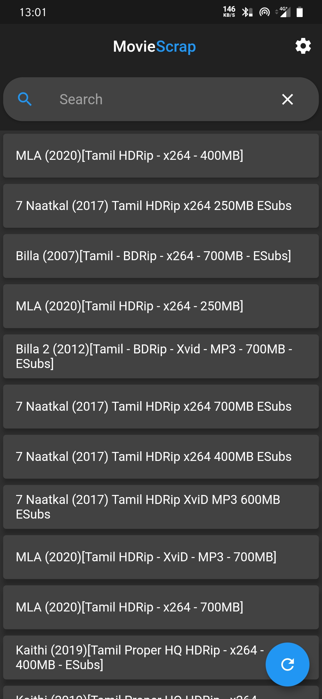
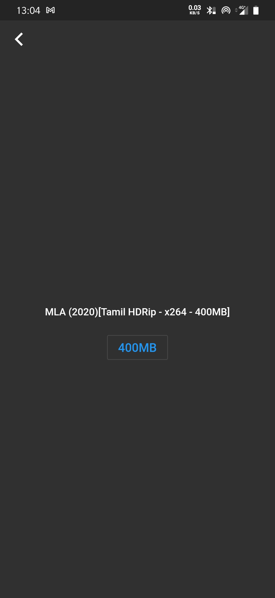
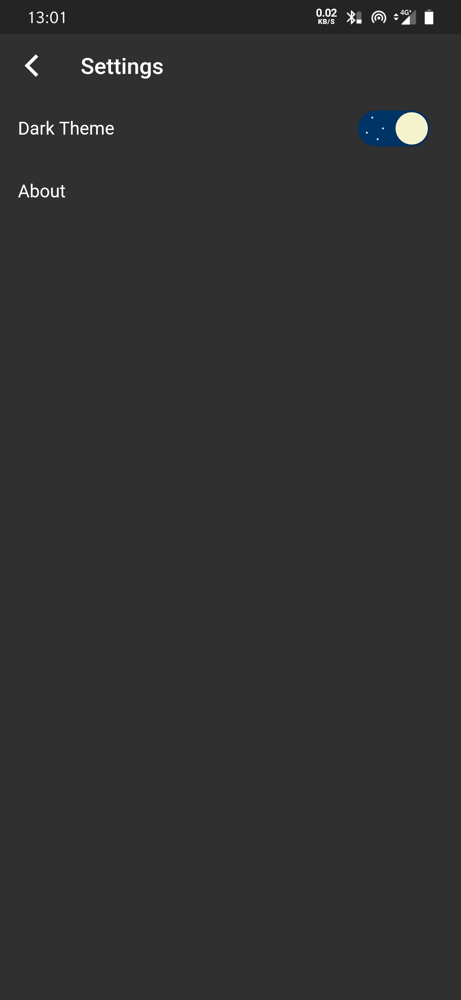
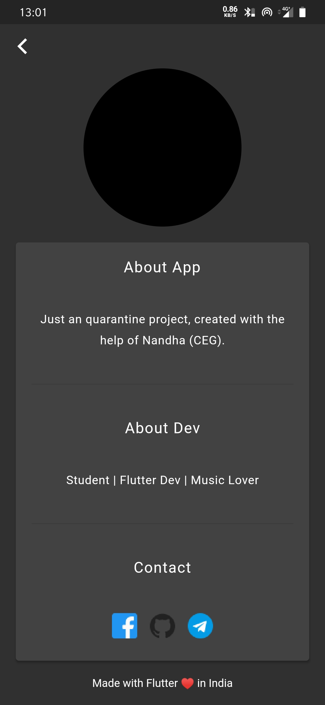
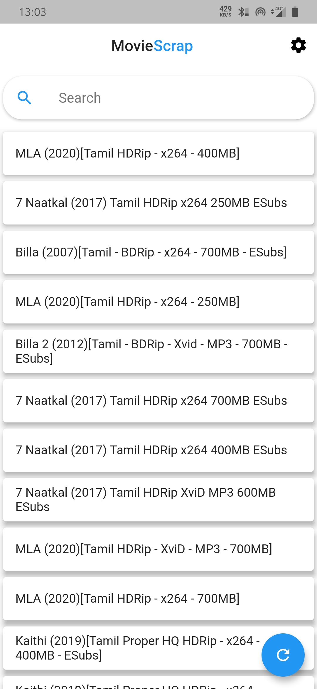
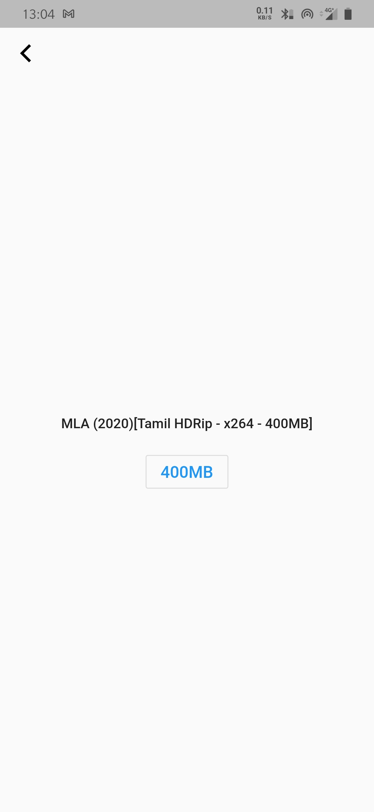
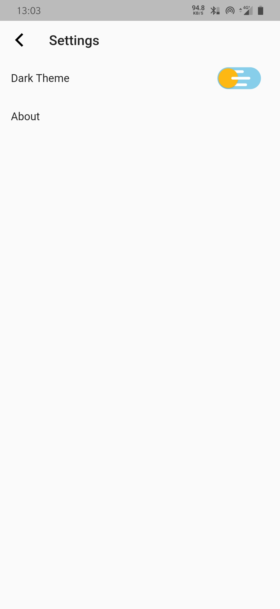
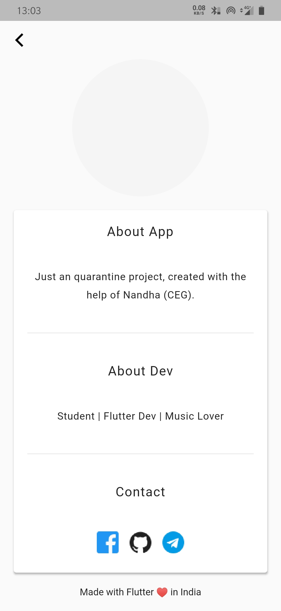

<h1 align='center'>
moviescrap
  </h1>

Single click movie downloader app.
Made with Flutter❤️. Works in Android,iOS, Web, Windows, Mac os, Linux
I don't support piracy by any mean. Use this app at your own risk.

         
  
         
  
  
  
  
  
  
 

# Screenshots

<table>
  <tr>
     <td>home</td>
     <td>link</td>
     <td>settings</td>
     <td>about</td>
  </tr>
  <tr>
    <td></td>
    <td></td>
    <td></td>
    <td></td>
   </tr>
 </table>

<table>
  <tr>
     <td>home light theme</td>
     <td>link light theme</td>
     <td>settings light theme</td>
     <td>about light theme</td>  
  </tr>
  <tr>
    <td></td>
    <td></td>
    <td></td>
    <td></td>
  </tr>
</table>

# Features

- Direct-link to torrent.
- Dark theme.
- Friendly UI.

